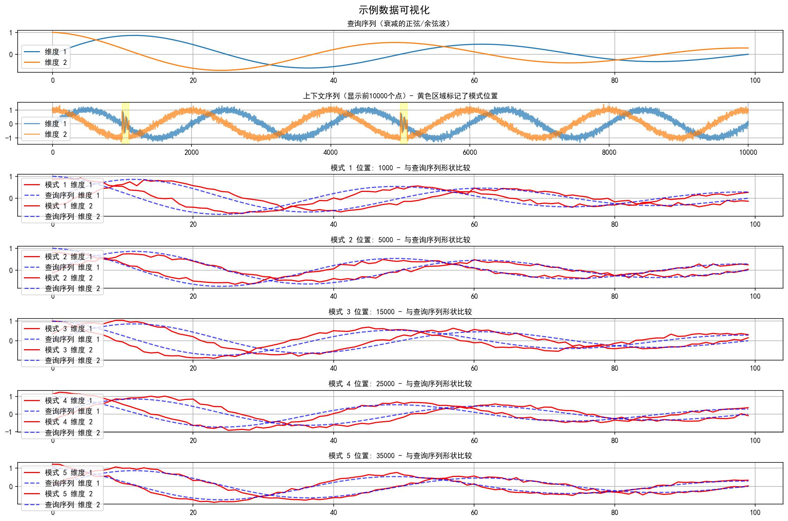
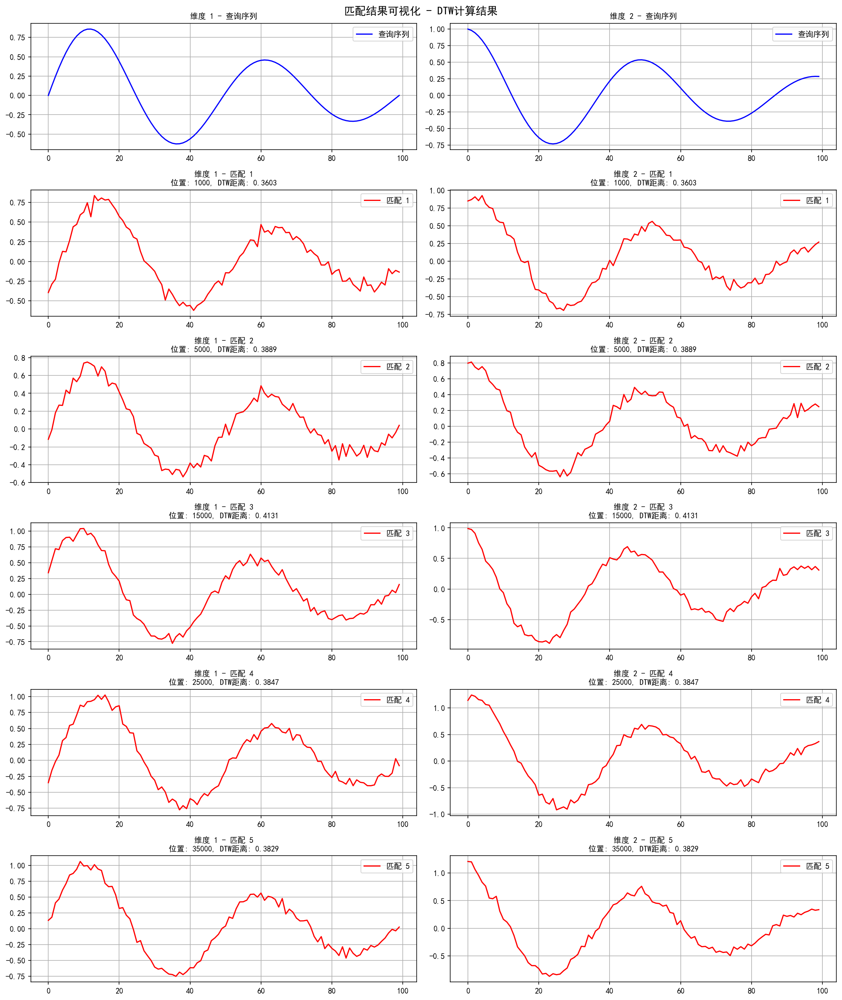
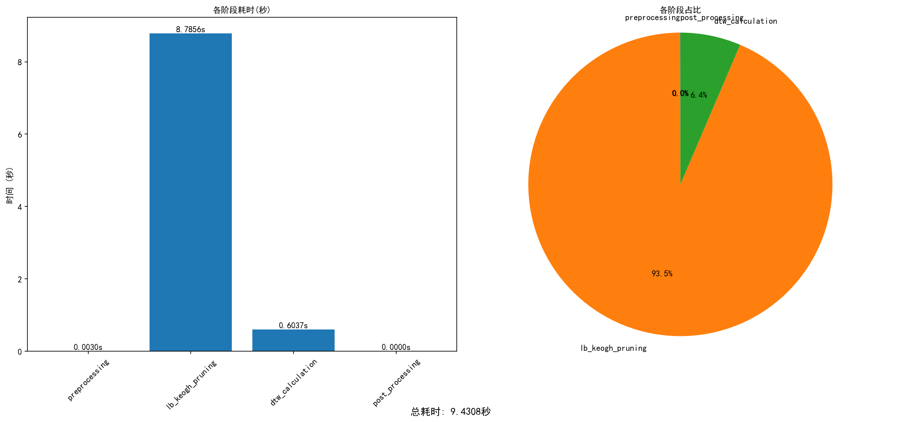
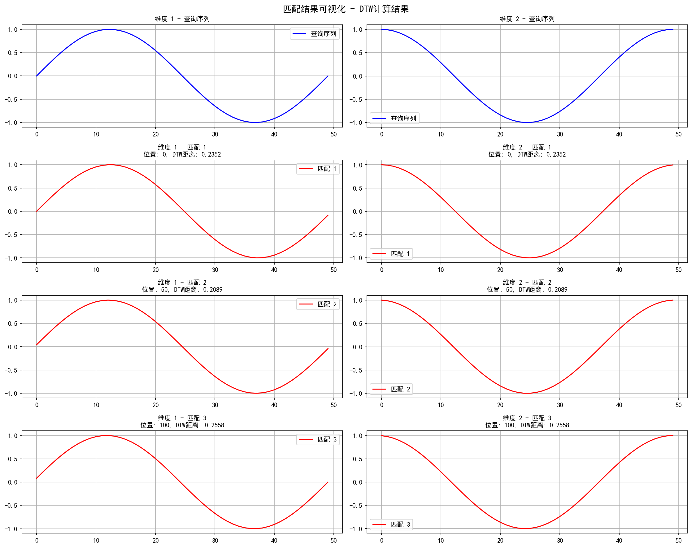
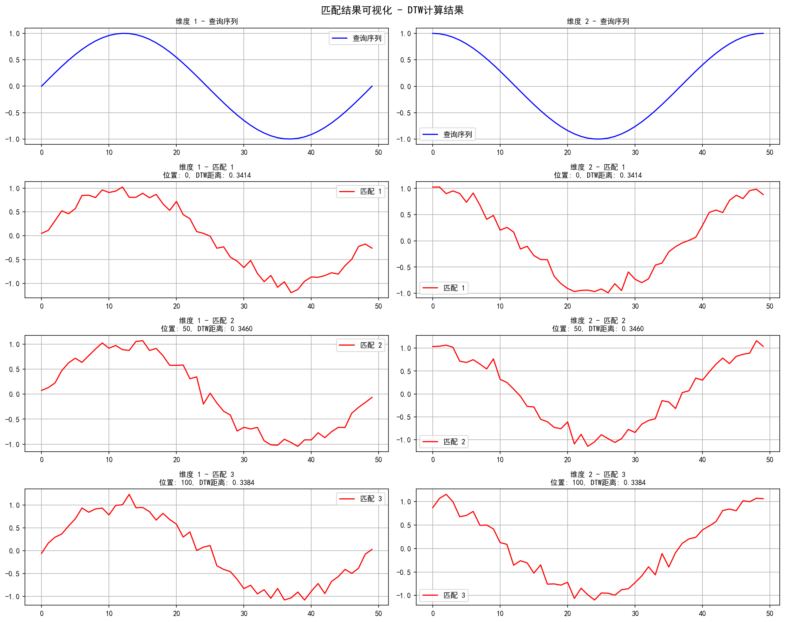
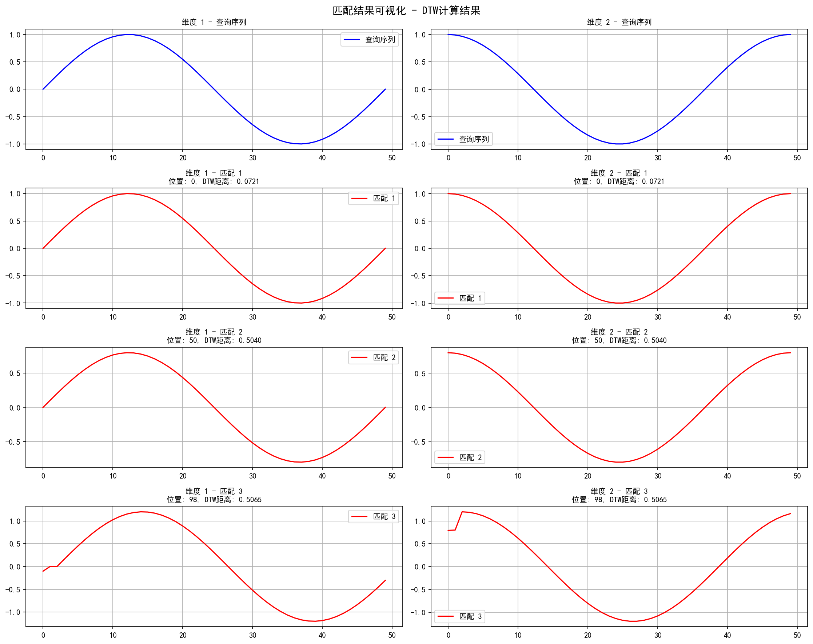
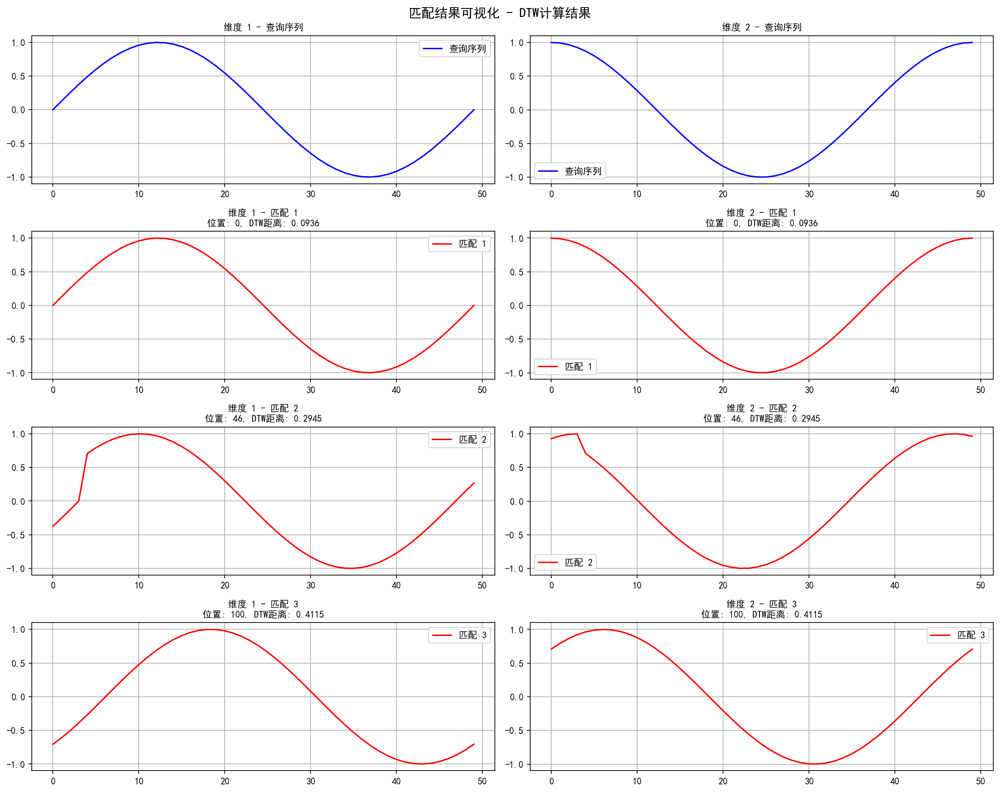

# Time Series Query Matcher

## Project Overview

The Time Series Query Matcher is an efficient subsequence search system specifically designed for multidimensional time series data. It can quickly locate segments within a long time series (context sequence) that are similar to a given query sequence, even when these segments contain noise, scaling variations, or time shifts.

This project utilizes Dynamic Time Warping (DTW) algorithm to implement flexible similarity calculations and significantly improves search efficiency through various optimization techniques, including downsampling, early abandoning strategies, and LB_Keogh lower bound pruning.

## Visualization Examples

### Example Data Visualization


### Matching Results Visualization


### Performance Analysis Visualization


## Key Features

- **Multidimensional Time Series Support**: Can process multidimensional data simultaneously, suitable for complex application scenarios such as sensor fusion and motion recognition
- **Efficient Search Algorithms**:
  - Fast pruning using LB_Keogh lower bound to reduce DTW calculations
  - Sequence downsampling support to accelerate large-scale data processing
  - Early abandoning strategy implementation to avoid unnecessary complete calculations
- **Flexible Matching Capabilities**:
  - Support for similar pattern recognition with non-strict time alignment
  - Can process similar patterns with amplitude variations
  - Ability to identify patterns with noise interference
- **Comprehensive Visualization Support**: Provides intuitive visualization of matching results and performance metrics
- **Multilingual Interface Support**: Automatic Chinese font adaptation, supporting Chinese display across different operating systems

## Installation

```bash
pip install -r requirements.txt
```

## Usage Examples

### Basic Usage

```python
import numpy as np
from time_series_matcher import TimeSeriesMatcher

# Create sample data
context = np.random.randn(10000, 2)  # 2D context sequence with length 10000
query = np.random.randn(100, 2)      # 2D query sequence with length 100

# Initialize the matcher
matcher = TimeSeriesMatcher(
    context, 
    threshold=0.5,         # DTW distance threshold
    radius=3,              # DTW warping radius
    position_group_ratio=0.1,  # Adjacent match grouping ratio
    lb_keogh_multiplier=1.5,   # LB_Keogh pruning multiplier
    downsample_factor=2        # Downsampling factor
)

# Find matches
matches, time_stats = matcher.find_matches(query)

# View matching results
print(f"Found {len(matches)} matches")
for pos, dist in matches[:5]:
    print(f"Position: {pos}, DTW distance: {dist:.4f}")

# Visualize matching results and save the image
matcher.visualize_matches(query, matches, save_path="images/my_matches.png")
```

### Built-in Demo

The project provides a complete demo function that generates synthetic data with specific patterns and displays matching results:

```python
from time_series_matcher import demo

# Run the demo
demo()
```

## Test Results

### Simple Sine Wave Pattern Matching


### Pattern Matching with Noise


### Pattern Matching with Different Scales


### Pattern Matching with Time Shifts


## Implementation Principles

### 1. Core Algorithms

- **Dynamic Time Warping (DTW)**: Allows time series to undergo non-linear deformation along the time axis to find the optimal alignment
- **FastDTW**: An efficient approximate implementation of DTW with linear time and space complexity
- **LB_Keogh Lower Bound**: Quickly excludes impossible matching candidates by calculating the distance between the query sequence and the upper/lower envelopes of the context window

### 2. Optimization Strategies

- **Downsampling**: Reduces computation by downsampling data during the initial search phase
- **Early Abandoning**: Stops calculation once the cumulative distance exceeds the threshold while computing the LB_Keogh lower bound
- **Match Merging**: Combines matching results that are close in distance to avoid reporting multiple positions for the same pattern

### 3. Parameter Tuning

- **threshold**: Controls the strictness of matching, lower values demand more strict matching
- **radius**: DTW warping radius, affects the flexibility of time alignment
- **lb_keogh_multiplier**: Adjusts the strictness of LB_Keogh pruning
- **downsample_factor**: Controls the downsampling ratio, affecting the balance between computation speed and accuracy

## Application Scenarios

- **Anomaly Detection**: Identify segments in time series that are similar to known anomaly patterns
- **Pattern Discovery**: Find repeatedly occurring patterns in long time series
- **Gesture Recognition**: Match specific gesture patterns in sensor data
- **Biological Signal Analysis**: Identify specific waveforms in biological signals such as ECG and EEG

## Performance Evaluation

The project provides performance evaluation and visualization tools to analyze the time proportion of each stage:
- Preprocessing stage
- LB_Keogh pruning stage
- DTW calculation stage
- Post-processing stage

## Test Suite

By running `test_matcher.py`, you can verify the algorithm's performance in different scenarios:
- Simple sine wave pattern matching
- Pattern matching with noise
- Pattern matching with different scales
- Pattern matching with time shifts 