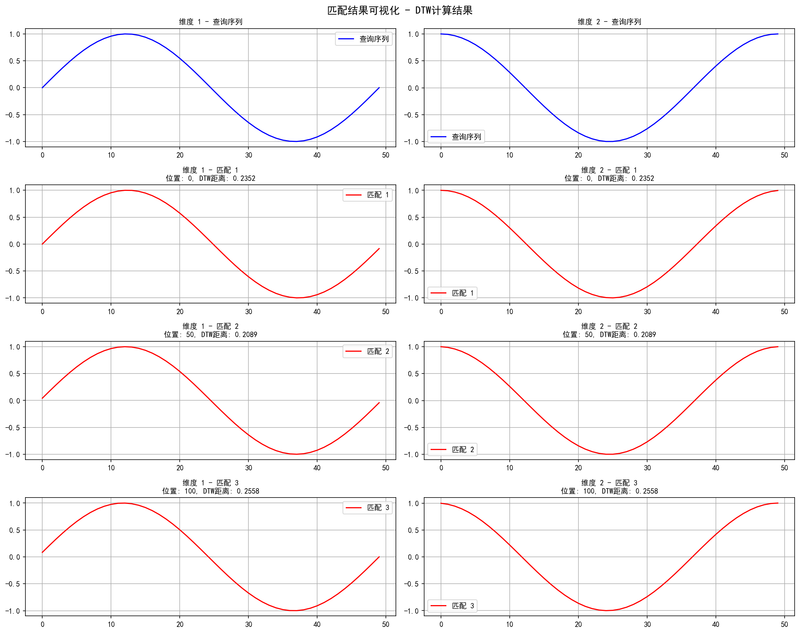

# 时间序列查询匹配器

## 项目简介

时间序列查询匹配器是一个高效的子序列搜索系统，专为多维时间序列数据设计。它能够在长时间序列（上下文序列）中快速定位与给定查询序列相似的片段，即使这些片段存在噪声、缩放变化或时间偏移等情况。

本项目利用动态时间规整（DTW）算法实现了灵活的相似度计算，并通过多种优化技术显著提升了搜索效率，包括降采样、早期放弃策略和LB_Keogh下界剪枝。

## 可视化效果

### 示例数据可视化


### 匹配结果可视化


### 性能分析可视化


## 主要特性

- **多维时间序列支持**：可同时处理多维数据，适用于传感器融合、动作识别等复杂应用场景
- **高效的搜索算法**：
  - 采用LB_Keogh下界快速剪枝，减少DTW计算次数
  - 支持序列降采样，加速大规模数据处理
  - 实现早期放弃策略，避免不必要的完整计算
- **灵活的匹配能力**：
  - 支持非严格时间对齐的相似模式识别
  - 可处理存在振幅变化的相似模式
  - 能够识别存在噪声干扰的模式
- **完整的可视化支持**：提供匹配结果和性能指标的直观可视化
- **中文界面支持**：自动适配中文字体，支持在不同操作系统下显示中文

## 安装依赖

```bash
pip install -r requirements.txt
```

## 使用示例

### 基本用法

```python
import numpy as np
from time_series_matcher import TimeSeriesMatcher

# 创建示例数据
context = np.random.randn(10000, 2)  # 长度为10000的二维上下文序列
query = np.random.randn(100, 2)      # 长度为100的二维查询序列

# 初始化匹配器
matcher = TimeSeriesMatcher(
    context, 
    threshold=0.5,         # DTW距离阈值
    radius=3,              # DTW warping半径
    position_group_ratio=0.1,  # 相邻匹配分组的比例
    lb_keogh_multiplier=1.5,   # LB_Keogh剪枝倍数
    downsample_factor=2        # 降采样因子
)

# 查找匹配
matches, time_stats = matcher.find_matches(query)

# 查看匹配结果
print(f"找到 {len(matches)} 个匹配")
for pos, dist in matches[:5]:
    print(f"位置: {pos}, DTW距离: {dist:.4f}")

# 可视化匹配结果并保存图像
matcher.visualize_matches(query, matches, save_path="images/my_matches.png")
```

### 内置演示

项目提供了完整的演示函数，生成包含特定模式的合成数据并展示匹配结果：

```python
from time_series_matcher import demo

# 运行演示
demo()
```

## 测试结果展示

### 简单正弦波模式匹配


### 带噪声的模式匹配


### 不同尺度的模式匹配


### 时间偏移的模式匹配


## 实现原理

### 1. 核心算法

- **动态时间规整（DTW）**：允许时间序列在时间轴上进行非线性变形，找到最佳对齐方式
- **FastDTW**：DTW的高效近似实现，具有线性时间和空间复杂度
- **LB_Keogh下界**：通过计算查询序列与上下文窗口的上下包络之间的距离，快速排除不可能匹配的候选项

### 2. 优化策略

- **降采样**：在初始搜索阶段对数据进行降采样，减少计算量
- **早期放弃**：在计算LB_Keogh下界时，一旦累积距离超过阈值即停止计算
- **匹配合并**：将距离相近的匹配结果合并，避免重复报告同一模式的多个位置

### 3. 参数调优

- **threshold**：控制匹配的严格程度，值越小要求越严格
- **radius**：DTW warping半径，影响时间对齐的灵活性
- **lb_keogh_multiplier**：调整LB_Keogh剪枝的严格程度
- **downsample_factor**：控制降采样比例，影响计算速度和精度平衡

## 应用场景

- **异常检测**：识别时间序列中与已知异常模式相似的片段
- **模式发现**：在长时间序列中寻找重复出现的模式
- **手势识别**：匹配传感器数据中的特定手势模式
- **生物信号分析**：在心电图、脑电图等生物信号中识别特定波形

## 性能评估

项目提供了性能评估和可视化工具，可以分析各阶段耗时比例：
- 预处理阶段
- LB_Keogh剪枝阶段
- DTW计算阶段
- 后处理阶段

## 测试套件

通过运行`test_matcher.py`可以验证算法在不同场景下的表现：
- 简单正弦波模式匹配
- 带噪声的模式匹配
- 不同尺度的模式匹配
- 时间偏移的模式匹配 